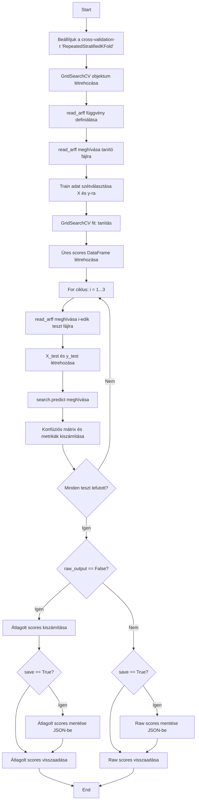
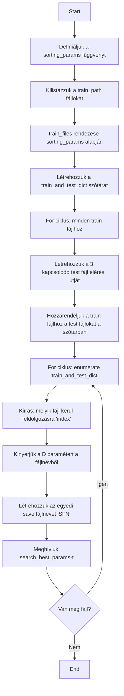

# Dokumentáció

## Conda környezet létrehozása

- [MiniConda letöltése](https://www.anaconda.com/docs/getting-started/miniconda/main)

```
conda create -n sklearn-env -c conda-forge scikit-learn
conda activate sklearn-env
```

- [Sklearn telepítési dokumentáció](https://scikit-learn.org/stable/install.html)

## Modul felépítés

- binary_classification
  - config
  - search_for_classifier

| Név                   | Leírás                                                    |
|-----------------------|-----------------------------------------------------------|
| config                | Az összes futtatható osztályozó + hyper paramater tunning |
| search_for_classifier | Az összes alapvető eszköz a `config` futtatásához         |

### Környzet felépítése

 - [ train/test fájlok ]
 - params_for_models
 - binary_classification
   - config
   - search_for_classifier
 - [ Python file a futtatáshoz ]

Pycharm-ban a `binary_classification` mappa **sources-root**!

**Imports update után nem kötelező!**

### Train és test fájl beállítása

- binary_classification
  - config

```python
train__path = [ "Train mappa helye" ]
test__path = [ "test mappa helye" ]
```
### Paraméterek beállítása az osztályozókhoz

- params_for_models
  - [ osztályozóhoz tartozó fájl ]

### Configuráció beállítása / hozzádása

- binary_classification
  - config

```python
def ComplementNB() -> None:
    from sklearn.naive_bayes import ComplementNB
    conf: dict[str, str | list[str]] = read_json_test_params("params_for_models/ComplementNB_params.json")
    automated_file_select_search(train__path, test__path, ComplementNB, conf, "ComplementNB", raw_output=False,
                                 save=True)
```

Kofiguráció helyének beállítása

```python
conf: dict[str, str | list[str]] = read_json_test_params("params_for_models/[ konfig fájl ]")
```

### Példa kód

```python
from binary_classification.config import SVCsigmoid

SVCsigmoid()
```

## Komponensek
### Több fájl mód: `automated_file_select_search`

#### Bemenetek:

| Név              | Tipus             | Leírás                                                   | alapértelmezett érték |
|------------------|-------------------|----------------------------------------------------------|-----------------------|
| `train_path`     | `string`          | A tanításra használt fájlok helye                        | -                     |
| `test_path`      | `string`          | A tesztelésre használt fájlok helye                      | -                     |
| `u_model`        | `ClassifierMixin` | A tesztelni kívánt osztályozó                            | -                     |
| `u_params`       | `dict`            | A tesztelni kívánt paraméterek                           | -                     |
| `save_file_name` | `string`          | A fájl névének előtagja a menteni kívánt adatokhoz       | -                     |
| `raw_output`     | `bool`            | Ha nem szeretnénk átlagolni az eredményeket (opcionális) | False                 |
| `save`           | `bool`            | Ha menteni kívánjuk az eredményket (opcionális)          | False                 |

#### Rövid leírás:
Ez a metódus végig megy a `train_path` váltózóban átadott mappán és a neki megfelelő tesztekhez elvégzi az osztályózó legjobb paramétereinek meghatározását a `search_best_params` függvény segítségével, majd elmenti a szükséges kimenetet.

#### Kimenet:

Egy pandas dataframe feltöltve aszükséges mutatőkkal és/vagy json file a mutatókkal.

Tartalmazza:

* Accuracy
* Sensitivity
* Specificity
* F1
* G-mean
* AUC


### Egy fájl mód: `search_best_params`

#### Bemenetek:

| Név              | Tipus             | Leírás                                                   | alapértelmezett érték |
|------------------|-------------------|----------------------------------------------------------|-----------------------|
| `u_model`        | `ClassifierMixin` | A tesztelni kívánt osztályozó                            | -                     |
| `u_params`       | `dict`            | A tesztelni kívánt paraméterek                           | -                     |
| `u_train`        | `string`          | A tanításra használni kivánt fájl elerési útja           | -                     |
| `u_test`         | `list[str]`       | A tesztelésre használni kivánt fájlok elerésí útja       | -                     |
| `u_features`     | `int`             | A fájlokban található tulajdonságok                      | -                     |
| `save_file_name` | `string`          | A fájl névének előtagja a menteni kívánt adatokhoz       | -                     |
| `raw_output`     | `bool`            | Ha nem szeretnénk átlagolni az eredményeket (opcionális) | False                 |
| `save`           | `bool`            | Ha menteni kívánjuk az eredményket (opcionális)          | False                 |

#### Rövid leírás:

A `Scikitlearn`-ben megtalálható `RepeatedStratifiedKFold` és a `GridSearchCV` függvények segítségével meghatározásra kerülnek a legjobb paraméterek az adott osztályozóhoz és elmenti a szükséges adatokat.

#### Kimenet:

Egy pandas dataframe feltöltve aszükséges mutatőkkal és/vagy json file a mutatókkal.

Tartalmazza:

* Accuracy
* Sensitivity
* Specificity
* F1
* G-mean
* AUC

### További információk:

#### `read_arff`: ez a függvény végzi az adatok beolvasását a fájlokból

##### Bemenet:
Egy arff formátumú fájl

##### Kimenet:
Egy padnas dataframe a szükséges adatokkal feltöltve.

### Mutatók:

#### Accuracy

Mennyire találta el az összes predikciót helyesen.

$$
\text{Accuracy} = \frac{TP + TN}{TP + TN + FP + FN}
$$

Kalkulációhoz: `accuracy_score` függvény

#### Sensitivity

A valódi pozitívok közül hányat talált el.

$$
\text{Sensitivity} = \frac{TP}{TP + FN}
$$

Kalkulációhoz: `recall_score` függvény

#### Specificity

A valódi negatívok közül hányat ismert fel.

$$
\text{Specificity} = \frac{TN}{TN + FP}
$$

#### F1 Score

A pontosság (precision) és a visszahívás (recall) harmonikus átlaga.

$$
F_1 = 2 \cdot \frac{\text{Precision} \cdot \text{Recall}}{\text{Precision} + \text{Recall}}
$$

Kalkulációhoz: `f1_score` függvény

#### G-mean

Egyensúlyozza a pozitív és negatív osztály teljesítményét.

$$
G\text{-mean} = \sqrt{\text{Sensitivity} \cdot \text{Specificity}}
$$

#### AUC

Megmutatja, hogy a modell mennyire jól különíti el a pozitív és negatív osztályokat.

$$
\text{AUC} = \int_0^1 \text{TPR}(\text{FPR}) \, d(\text{FPR})
$$

TPR (True Positive Rate)

$$
\text{TPR} = \frac{TP}{TP + FN}
$$

FPR (False Positive Rate)

$$
\text{FPR} = \frac{FP}{FP + TN}
$$

Numerikus közelítés (trapéz módszer)

$$
\text{AUC} \approx  \sum_{i=1}^{n-1} (FPR_{i+1} - FPR_{i})  \cdot \frac{TPR_{i+1}+TPR_i}{2}
$$

Kalkulációhoz: `auc` függvény

## Példa kimenetek:

### Json file:

```json
{
  "columns": [
    "Mean"
  ],
  "index": [
    "Accuracy",
    "Sensitivity",
    "Specificity",
    "F1",
    "G-mean",
    "UAC"
  ],
  "data": [
    [
      0.7883333333
    ],
    [
      0.2666666667
    ],
    [
      0.8462962963
    ],
    [
      0.2008885455
    ],
    [
      0.4745044847
    ],
    [
      0.5
    ]
  ]
}
```
### Pandas dataframe:

|             | Mean         |
|-------------|--------------|
| Accuracy    | 0.7883333333 |
| Sensitivity | 0.2666666667 |
| Specificity | 0.8462962963 |
| F1          | 0.2008885455 |
| G-mean      | 0.4745044847 |
| UAC         | ≈            |

**Ezek az értékek kizárolag példa értéküek!**

## Szükséges könyvtárak:

* Numpy
* Pandas
* Sklearn
* Scipy
* re
* io
* os
* typing

## Folyamatábra
### `search_best_params`

### `automated_file_select_search`


