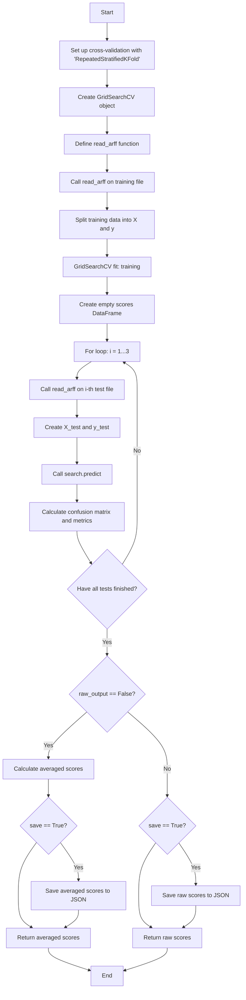
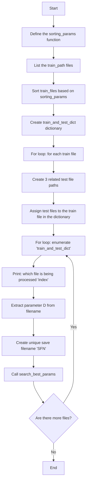

# Documentation

## Conda environment creation

- [MiniConda download](https://www.anaconda.com/docs/getting-started/miniconda/main)

```
conda create -n sklearn-env -c conda-forge scikit-learn
conda activate sklearn-env
```

- [Sklearn installation instructions](https://scikit-learn.org/stable/install.html)

## Module guide

- binary_classification
  - config
  - search_for_classifier

| Név                   | Leírás                                           |
|-----------------------|--------------------------------------------------|
| config                | All runnable classifiers + hyperparameter tuning |
| search_for_classifier | All nessesary components to run `config`         |

### Structure of the environment

 - [ train/test files ]
 - params_for_models
 - binary_classification
   - config
   - search_for_classifier
   - useful_tools
 - [ Main python file]

### Train/test files setup

- binary_classification
  - config

```python
train__path = [ "Train folder location" ]
test__path = [ "Test folder location" ]
```
### Configuring classifier parameters

- params_for_models
  - [ file associated with the classifier ]

### Setting or adding a configuration

- binary_classification
  - config

```python
def ComplementNB() -> None:
    from sklearn.naive_bayes import ComplementNB
    conf: dict[str, str | list[str]] = read_json_test_params("params_for_models/ComplementNB_params.json")
    automated_file_select_search(train__path, test__path, ComplementNB, conf, "ComplementNB", raw_output=False,
                                 save=True)
```

Setting configuration path

```python
conf: dict[str, str | list[str]] = read_json_test_params("params_for_models/[ conf location ]")
```

### Example code

```python
from binary_classification.config import SVCsigmoid

SVCsigmoid()
```
### Useful_tools

 - ignore_error

**It also runs the classifier(s) when an error occurs.**

## Components
### Multi-file mode: `automated_file_select_search`

#### Inputs:
| Name             | Type              | Description                                              | Default value |
|------------------|-------------------|----------------------------------------------------------|---------------|
| `train_path`     | `string`          | Path to the training files                               | -             |
| `test_path`      | `string`          | Path to the test files                                   | -             |
| `u_model`        | `ClassifierMixin` | The classifier to be tested                              | -             |
| `u_params`       | `dict`            | Parameters to be tested                                  | -             |
| `save_file_name` | `string`          | Prefix for the filename used when saving results         | -             |
| `raw_output`     | `bool`            | If `True`, outputs raw (non-averaged) results (optional) | False         |
| `save`           | `bool`            | If `True`, saves the results to file (optional)          | False         |

#### Short description:
This method iterates through the folder provided in the `train_path` variable, and for each corresponding test set, it determines the best parameters for the classifier using the `search_best_params` function. Then, it saves the necessary output.
#### Output:

A pandas DataFrame populated with the required metrics and/or a JSON file containing the metrics.

Includes:

* Accuracy
* Sensitivity
* Specificity
* F1 Score
* G-mean
* AUC (Area Under the Curve)
* Balanced Accuracy


### Single-file mode: `search_best_params`

#### Inputs:
| Name             | Type              | Description                                    | Default value |
|------------------|-------------------|------------------------------------------------|---------------|
| `u_model`        | `ClassifierMixin` | The classifier to be tested                    | -             |
| `u_params`       | `dict`            | Parameters to be tested                        | -             |
| `u_train`        | `string`          | Path to the file used for training             | -             |
| `u_test`         | `list[str]`       | Paths to the files used for testing            | -             |
| `u_features`     | `int`             | Number of features in the files                | -             |
| `save_file_name` | `string`          | Prefix for the filename when saving data       | -             |
| `raw_output`     | `bool`            | If true, do not average the results (optional) | False         |
| `save`           | `bool`            | If true, save the results (optional)           | False         |


#### Short description:

Using `RepeatedStratifiedKFold` and `GridSearchCV` from Scikit-learn, the best parameters for the given classifier are determined, and the necessary data are saved.
#### Output:

A pandas DataFrame populated with the required metrics and/or a JSON file containing the metrics.

**Contains:**

* Accuracy
* Sensitivity
* Specificity
* F1
* G-mean
* AUC
* Balanced Accuracy

### Additional informations:

#### `read_arff`: This function handles reading data from the files.

##### Input:
An ARFF format file

##### Output:
A pandas DataFrame populated with the required data.

### Metrics:

#### Accuracy

How accurately it predicted all outcomes.

$$
\text{Accuracy} = \frac{TP + TN}{TP + TN + FP + FN}
$$

For calculations: `accuracy_score` function

#### Sensitivity

How many of the true positives were correctly identified.

$$
\text{Sensitivity} = \frac{TP}{TP + FN}
$$

For calculations: `recall_score` function

#### Specificity

How many of the true negatives were correctly recognized.

$$
\text{Specificity} = \frac{TN}{TN + FP}
$$

#### F1 Score

The harmonic mean of precision and recall.

$$
F_1 = 2 \cdot \frac{\text{Precision} \cdot \text{Recall}}{\text{Precision} + \text{Recall}}
$$

For calculations: `f1_score` function

#### G-mean

Balances the performance between the positive and negative classes.

$$
G\text{-mean} = \sqrt{\text{Sensitivity} \cdot \text{Specificity}}
$$

#### AUC

Shows how well the model separates the positive and negative classes.

$$
\text{AUC} = \int_0^1 \text{TPR}(\text{FPR}) \, d(\text{FPR})
$$

TPR (True Positive Rate)

$$
\text{TPR} = \frac{TP}{TP + FN}
$$

FPR (False Positive Rate)

$$
\text{FPR} = \frac{FP}{FP + TN}
$$

Numerical approximation (trapezoidal method)

$$
\text{AUC} \approx  \sum_{i=1}^{n-1} (FPR_{i+1} - FPR_{i})  \cdot \frac{TPR_{i+1}+TPR_i}{2}
$$

For calculation: `auc` function

#### Balanced Accuracy

The balanced accuracy in binary and multiclass classification problems to deal with imbalanced datasets. It is defined as the average of recall obtained on each class.

For calculation: `balanced_accuracy` function

## Example outputs:

### Json file:

```json
{
  "columns": [
    "Mean"
  ],
  "index": [
    "Accuracy",
    "Sensitivity",
    "Specificity",
    "F1",
    "G-mean",
    "UAC",
    "Balanced Accuracy"
  ],
  "data": [
    [
      0.7883333333
    ],
    [
      0.2666666667
    ],
    [
      0.8462962963
    ],
    [
      0.2008885455
    ],
    [
      0.4745044847
    ],
    [
      0.5
    ],
    [
      0.5
    ]
  ]
}
```
### Pandas dataframe:

|                   | Mean         |
|-------------------|--------------|
| Accuracy          | 0.7883333333 |
| Sensitivity       | 0.2666666667 |
| Specificity       | 0.8462962963 |
| F1                | 0.2008885455 |
| G-mean            | 0.4745044847 |
| UAC               | 0.5          |
| Balanced Accuracy | 0.5          |

**These values are for example purposes only!**

## Dependencies

* Numpy
* Pandas
* Sklearn
* Scipy
* re
* io
* os
* typing

## Citation of sources

* [SyntImbNoisyDataForClassification](https://github.com/szghlm/SyntImbNoisyData)

## Flowchart
### `search_best_params`

### `automated_file_select_search`


