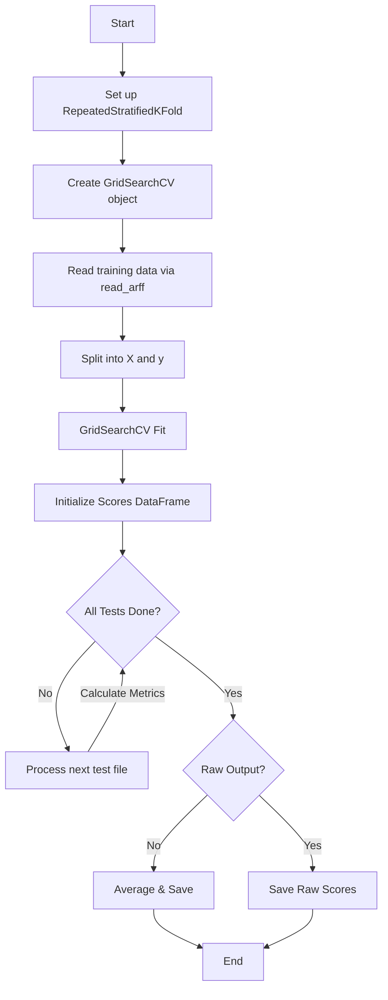

# Binary Classification Research Project

A comprehensive framework for evaluating binary classifiers on synthetic imbalanced and noisy datasets. This project provides tools for automated parameter searching, metric calculation, and visualization of results.

---

## 📜 Licensing

- **Source Code:** [Apache License 2.0](LICENSE)
- **Figures and Data:** [CC-BY 4.0](https://creativecommons.org/licenses/by/4.0/)

---

## 🚀 Getting Started

### Environment Setup

This project uses Conda for environment management. Follow these steps to set up your environment:

1. **Download Conda:** [MiniConda download](https://www.anaconda.com/docs/getting-started/miniconda/main)
2. **Create Environment:**
   ```bash
   conda create -n sklearn-env -c conda-forge scikit-learn
   conda activate sklearn-env
   pip install pandas
   ```

For detailed Scikit-learn installation instructions, visit the [official documentation](https://scikit-learn.org/stable/install.html).

---

## 📂 Project Structure

| Component | Description |
| :--- | :--- |
| `binary_classification/config` | Contains runnable classifiers and hyperparameter tuning logic. |
| `binary_classification/search_for_classifier` | Core components for executing classifier configurations. |
| `Sorted figures and assets/` | Organized repository of research results and visualizations. |

### Core Directory Layout

```text
.
├── binary_classification/
│   ├── config/              # Classifier configurations
│   ├── search_for_classifier/ # Search logic
│   └── useful_tools/        # Utility functions (e.g., error handling)
├── params_for_models/       # JSON configuration files for each model
├── Sorted figures and assets/ # Standardized results and plots
└── README.md                # Project documentation
```

---

## 🛠️ Configuration & Usage

### 1. Training/Test Setup
Configure your data paths in `binary_classification/config`:

```python
train__path = [ "Path/to/Train/Folder" ]
test__path = [ "Path/to/Test/Folder" ]
```

### 2. Defining a Classifier Configuration
Configurations are defined using the `automated_file_select_search` function:

```python
def ComplementNB() -> None:
    from sklearn.naive_bayes import ComplementNB
    conf = read_json_test_params("params_for_models/ComplementNB_params.json")
    automated_file_select_search(
        train__path, test__path, ComplementNB, conf, "ComplementNB", 
        raw_output=False, save=True
    )
```

### 3. Execution Example
```python
from binary_classification.config import SVCsigmoid

# Start the classification and evaluation process
SVCsigmoid()
```

---

## 📊 Components & Metrics

### Automated Search Modes

#### `automated_file_select_search` (Multi-file)
Iterates through training folders, identifies corresponding test sets, finds optimal parameters, and saves the metrics.

#### `search_best_params` (Single-file)
Uses `RepeatedStratifiedKFold` and `GridSearchCV` to determine optimal classifier parameters for a specific dataset.

### Evaluation Metrics

We use a comprehensive suite of metrics to evaluate model performance, especially under imbalanced conditions:

- **Accuracy:** Overall prediction correctness.
- **Sensitivity (Recall):** Identification rate of true positives.
- **Specificity:** Identification rate of true negatives.
- **F1 Score:** Harmonic mean of precision and recall.
- **G-mean:** Geometric mean of sensitivity and specificity (essential for imbalanced data).
- **AUC:** Model discriminative power.
- **Balanced Accuracy:** Average recall per class.

> [!TIP]
> **Check out `Sorted figures and assets/documentation.md`** for a detailed guide on how results are stored and named.

---

## 📐 Mathematical Definitions

| Metric | Formula |
| :--- | :--- |
| **Accuracy** | $\frac{TP + TN}{TP + TN + FP + FN}$ |
| **Sensitivity** | $\frac{TP}{TP + FN}$ |
| **Specificity** | $\frac{TN}{TN + FP}$ |
| **F1 Score** | $2 \cdot \frac{\text{Precision} \cdot \text{Recall}}{\text{Precision} + \text{Recall}}$ |
| **G-mean** | $\sqrt{\text{Sensitivity} \cdot \text{Specificity}}$ |
| **AUC** | $\int_0^1 \text{TPR}(\text{FPR}) \, d(\text{FPR})$ |

---

## 📈 Process Flow

### `search_best_params`

```mermaid
flowchart TD
    A[Start] --> B[Set up RepeatedStratifiedKFold] 
    B --> C[Create GridSearchCV object] 
    C --> D[Read training data via read_arff] 
    D --> E[Split into X and y] 
    E --> F[GridSearchCV Fit] 
    F --> G[Initialize Scores DataFrame] 
    G --> H{All Tests Done?}
    H -- No --> I[Process next test file]
    I -- Calculate Metrics --> H
    H -- Yes --> J{Raw Output?}
    J -- No --> K[Average & Save]
    J -- Yes --> L[Save Raw Scores]
    K --> M[End]
    L --> M
```

---

## 📚 Dependencies & Citation

### Dependencies
- **Data:** `numpy`, `pandas`, `scipy`
- **Machine Learning:** `scikit-learn`
- **System:** `re`, `io`, `os`, `typing`

### Original Source/Citation
- [SyntImbNoisyDataForClassification](https://github.com/szghlm/SyntImbNoisyData)

---
